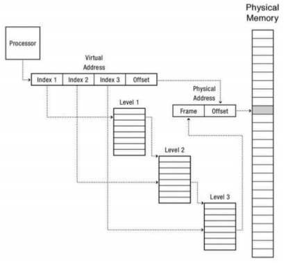

# Ejercicios parciales resueltos

- [Kernel y Procesos](#kernel-y-procesos)
- [Memoria](#memoria)
- [Scheduling](#scheduling)
- [Concurrencia](#concurrencia)
- [Filesystem](#filesystem)
- [Multiple Choices](#multiple-choices)

---

## Kernel y Procesos

### Describa qué es un proceso: qué abstrae, cómo lo hace, cuál es su estructura. Además, explique el mecanismo por el cual el proceso cree tener la memoria completa de la máquina cuando en realidad solo tiene lo necesario para su funcionamiento.

<details>
<summary>Respuesta</summary>
<p>

Un proceso abstrae la ejecución de un programa, incluyendo su estado, recursos y contexto de ejecución. El proceso tiene:
- Text: Código del programa.
- Data: Variables globales y estáticas.
- Heap: Memoria dinámica.
- Stack: Variables locales y llamadas a funciones.
Y file descriptors, datos del kernel, registros, etc.

Para crear la ilusión de que dispone de toda la memoria del sistema, se utiliza la memoria virtual: cada proceso tiene su propio espacio de direcciones virtuales, que es traducido a direcciones físicas por el kernel. Esto permite al proceso, además de abstraerse de la memoria física, a protegerse de otros procesos su propia memoria.

</p>
</details>

### ¿Cuál o cuáles mecanismos utiliza el kernel para garantizar el aislamiento entre procesos?  Estos mecanismos están relacionados con el hardware. Explique por qué deben existir y dónde se soporta su funcionamiento.

<details>
<summary>Respuesta</summary>
<p>

El kernel utiliza la memoria virtual y los modos de ejecución del procesador para garantizar el aislamiento entre procesos. La memoria virtual permite a cada proceso tener su propio espacio de direcciones, que es traducido a direcciones físicas por el kernel. Los modos de ejecución del procesador permiten que ciertas instrucciones (las privilegiadas) solo puedan ser ejecutadas en modo kernel, evitando que los procesos puedan acceder a recursos críticos del sistema.

La memoria virtual necesita que el hardware disponga de un MMU (Memory Management Unit) que realice las traducciones de direcciones virtuales a físicas, y los modos de ejecución necesitan que el procesador soporte modos de ejecución privilegiados y no privilegiados.

</p>
</details>

### ¿Qué es el stack? Explique el mecanismo de funcionamiento del stack para x86 de la siguiente función: int read(void *buff, size_t len, size_t num, int fd);. Cómo se pasan los parámetros, dirección de retorno, etc.

<details>
<summary>Respuesta</summary>
<p>

El stack es la región del espacio de direcciones que se utiliza para almacenar variables locales, argumentos de funciones, direcciones de retorno, etc. Para esto, es posible utilizar las instrucciones push y pop para agregar y quitar elementos del stack, o bien manipular directamente el puntero de pila que apunta el tope del stack.

Para el caso de función read:

1. Se almacenan los registros caller-saved en el stack.
2. Se almacenan los argumentos de la función en el stack, en orden inverso: fd, num, len, buff.
3. Se llama a la función.
4. Se obtienen los argumentos de la función del stack.
4. Dentro de la función llamada, se almacenan los registros callee-saved en el stack.
5. Se realiza la operación de la función.
6. Se almacena el valor de retorno en el registro eax y termina la función.
7. Se restauran los registros callee-saved del stack.

</p>
</details>

### ¿Qué es el Address Space? ¿Qué partes tiene? ¿Para qué sirve? Describa el/los mecanismos para crear procesos en unix, sus syscalls, ejemplifique. Adicional: wait.

<details>
<summary>Respuesta</summary>
<p>

El address space es el rango de direcciones de memoria que un proceso puede acceder y utilizar durante su ejecución. Está compuesto por text, data(variables estáticas y globales), heap (memoria dinámica) y stack (variables locales y llamadas a funciones). Sirve para que cada proceso tenga su propio espacio de direcciones y no pueda acceder a la memoria de otros procesos. Si se desease compartir memoria entre procesos, se puede utilizar memoria compartida a la que un proceso puede acceder según sus permisos.

Para crear procesos en Unix, se utiliza la syscall fork, que crea un proceso hijo idéntico al proceso padre copiando todo su espacio de direcciones, y exec, que reemplaza la imagen del proceso actual con un nuevo programa. La syscall fork devuelve 2 process IDs, el PID del proceso hijo para el padre y 0 para el proceso hijo. Wait se utiliza para esperar la finalización de un proceso hijo desde el proceso padre.

Por ejemplo:

```c
int main(void) {
    pid_t pid = fork();
    if (pid < 0) {
        perror("fork");
        return 1;
    }
    if (pid == 0) { // Proceso hijo
        execvp("ls", NULL);
    } else { // Proceso padre
        wait(NULL);
    }
    return 0;
}
```

</p>
</details>

### Explicar detalladamente 2 formas de pasar de modo usuario a modo Kernel, y 2 formas de pasar de modo Kernel a modo usuario.

<details>
<summary>Respuesta</summary>
<p>

De modo usuario a modo Kernel:

- Interrupciones: señal asincrónica enviada hacia el procesador de que algún evento externo ha sucedido y puede requerir atención del kernel.
- Syscalls: instrucciones que permiten a los procesos de usuario solicitar servicios al kernel.
- Excepciones de procesador: un evento de hardware causado por un programa de usuario. Por ejemplo, una división por cero, un acceso a memoria no permitido, etc.

De modo Kernel a modo usuario:

- Un nuevo proceso: el kernel crea un nuevo proceso y lo pone en modo usuario.
- Continuar después de una interrupción o syscall: el kernel retorna el control al proceso que estaba en modo usuario.
- Cambio entre diferentes procesos: el kernel se encarga de cambiar el contexto de ejecución entre diferentes procesos.

</p>
</details>

### ¿Qué es un proceso zombie? ¿Por qué se produce? ¿Cómo se soluciona? ¿Qué es un proceso huérfano? ¿Por qué se produce? ¿Cómo se soluciona?

<details>
<summary>Respuesta</summary>
<p>

Un proceso zombie es un proceso que ha terminado su ejecución pero que aún tiene una entrada en la tabla de procesos del kernel. Esto se produce porque el kernel necesita mantener la entrada en la tabla de procesos para que el proceso padre pueda obtener el estado de salida del proceso hijo. Para solucionarlo, el proceso padre debe llamar a la syscall wait para obtener el estado de salida del proceso hijo y permitir que el kernel libere la entrada en la tabla de procesos.

Un proceso huérfano es un proceso cuyo proceso padre ha terminado su ejecución, por lo que no tiene un padre que sea capaz de obtener su estado de salida y liberarlo. Para solucionarlo, el kernel asigna como padre del proceso huérfano al proceso init, que se encarga de esperar a los procesos huérfanos y liberar sus recursos.

</p>
</details>

### Escriba un programa en C que permita jugar a dos procesos al ping pong, la pelota es un entero, cada vez que un proceso recibe la pelota debe incrementar en 1 su valor. Se corta por overflow o cambio de signo.

<details>
<summary>Respuesta</summary>
<p>

```c
int main(void) {
    int pelota = 0;

    int padre_a_hijo[2], hijo_a_padre[2];
    pipe(padre_a_hijo);
    pipe(hijo_a_padre);

    pid_t pid = fork();
    if (pid < 0) {
        perror("fork");
        exit(1);
    }
    if (pid == 0) {
        close(padre_a_hijo[WRITE]);
        close(hijo_a_padre[READ]);

        while (pelota >= 0) {
            read(padre_a_hijo[READ], &pelota, sizeof(pelota));
            pelota++;
            write(hijo_a_padre[WRITE], &pelota, sizeof(pelota));
        }
        close(padre_a_hijo[READ]);
        close(hijo_a_padre[WRITE]);
    } else {
        close(padre_a_hijo[READ]);
        close(hijo_a_padre[WRITE]);

        write(padre_a_hijo[WRITE], &pelota, sizeof(pelota));
        while (pelota >= 0) {
            read(hijo_a_padre[READ], &pelota, sizeof(pelota));
            pelota++;
            write(padre_a_hijo[WRITE], &pelota, sizeof(pelota));
        }
        close(padre_a_hijo[WRITE]);
        close(hijo_a_padre[READ]);
    }
    return 0;
}
```

</p>
</details>

### ¿Por qué es necesario el Kernel? De por lo menos 4 motivos.

<details>
<summary>Respuesta</summary>
<p>

- **Planificación de procesos**: El kernel se encarga de decidir qué proceso se ejecuta en cada momento.
- **Gestión y protección de memoria**: El kernel se encarga de asignar y proteger la memoria de cada proceso.
- **Proveer un sistema de archivos**: El kernel se encarga de proveer un sistema de archivos para que los procesos puedan almacenar y recuperar información.
- **Creación y finalización de procesos**: El kernel se encarga de crear y finalizar procesos, y de proveer mecanismos para que los procesos puedan comunicarse entre sí.
- **Gestión de dispositivos**: El kernel se encarga de gestionar los dispositivos de hardware y proveer una interfaz para que los procesos puedan interactuar con ellos.
- **Proveer una API**: El kernel provee una API para que los procesos puedan interactuar con el hardware y los recursos del sistema.

</p>
</details>

### ¿Cuáles son los requerimientos mínimos de hardware para poder construir un kernel?

<details>
<summary>Respuesta</summary>
<p>

1. Modo Dual: Permitir la ejecución de instrucciones en modo usuario y modo kernel, asegurando que ciertas operaciones solo puedan ser realizadas en modo kernel y evitando que los programas de usuario accedan directamente a los recursos del hardware.

2. Instrucciones Privilegiadas: Conjunto de instrucciones que solo pueden ser ejecutadas en modo kernel, que permitan acceso a recursos de hardware y operaciones críticas.

3. Timer Interrupts: Soportar un temporizador en hardware que pueda generar interrupciones periódicas para que el kernel pueda recuperar el control sea cual sea el estado del sistema.

4. Protección de Memoria:  Soporte de hardware para separar y proteger áreas de memoria utilizadas por diferentes procesos.
</p>
</details>

### Escriba un programa en C que simule el funcionamiento de una shell primitiva. ¿Qué debería agregarse para poder encadenar dos comandos por salidas y entradas estándar?

<details>
<summary>Respuesta</summary>
<p>

```c

#define BUF 256
#define CMD 32

void tokenize(char *cmd[16], char *buffer) {
    char *token;
    size_t i = 0;
    token = strtok(buffer, " \t\n");
    while (token != NULL && i < CMD-1) {
        cmd[i++] = token;
        token = strtok(NULL, " \t\n");
    }
    cmd[i] = NULL;
}

int shell(void) {
    char buffer[BUF];
    char *cmd[CMD];

    while (1) {
        if (getcwd(buffer, BUF) == NULL) return 1;
        printf("%s%s ", buffer, "$");
        if (fgets(buffer, BUF, stdin) == NULL) break;
        if (!strcmp(buffer, "exit\n")) break;

        tokenize(cmd, buffer);

        if (!strcmp (cmd[0], "cd")) {
            if (chdir(cmd[1]) == -1) perror("chdir");
            continue;
        }

        pid_t pid = fork();
        if (pid < 0) {
            perror("fork");
            return 1;
        }
        if (pid == 0) {
            if (execvp(cmd[0], cmd) == -1) {
                perror("execvp");
                return 1;
            }
        } else {
            wait(NULL);
        }
    }
    free(cmd);
    return 0;
}

```

Para encadenar dos comandos por salidas y entradas estándar, se puede utilizar pipes al encontrarse con símbolos de redirección, haciendo por ejemplo que la salida de un comando sea la entrada del siguiente.

</p>
</details>

---

## Memoria

### ¿Qué es la memoria virtual? ¿Qué mecanismos conoce?: describa los tres que a ud. le parezcan más relevantes.

<details>
<summary>Respuesta</summary>
<p>

La memoria virtual es la abstracción de la memoria física que permite a los procesos tener la ilusión de disponer de toda la memoria del sistema, cuando en realidad solo tienen acceso a una parte de ella. Los mecanismos más relevantes son:

- **Base y Bound**: Asigna a cada proceso una sección de memoria contigua que comienza en la base y termina en base + bound. Si se intenta acceder a una dirección fuera de este rango, se produce un error.

- **Tabla de Segmentos**: Divide la memoria en segmentos con base y bound. La tabla de segmentos contiene la base, el límite y los permisos de cada segmento.

- **Paginación**: Divide la memoria en bloques de tamaño fijo llamados páginas. Cada proceso accede a la memoria a través de direcciones virtuales que son traducidas a direcciones físicas mediante tablas de páginas, que contienen la dirección física de cada página. Para mejorar el rendimiento, es posible utilizar una TLB (Translation Lookaside Buffer) que almacena las traducciones más frecuentes.

</p>
</details>

### Describa cómo fue variando la estructura del address space respecto la memoria física en: base y bound, tabla de registros y paginación. Explique con diagramas.

<details>
<summary>Respuesta</summary>
<p>


Una de las primeras técnicas para proteger la memoria es la utilización de Base y Bound. A cada proceso se le asigna una sección de memoria contigua que comienza en la base y termina en base + bound. Si se intenta acceder a una dirección fuera de este rango, se produce un error.


El método de tabla de segmentos consiste en dividir la memoria en segmentos con base y bound. De esta forma, no es necesario disponer de memoria contigua para un proceso entereamente y se pueden aprovechar mejor los espacios libres. La tabla de segmentos contiene la base, el límite y los permisos de cada segmento.


La paginación divide la memoria en bloques de tamaño fijo llamados páginas. Cada proceso accede a la memoria a través de direcciones virtuales que son traducidas a direcciones físicas mediante tablas de páginas, que contienen la dirección física de cada página. Para mejorar el rendimiento, es posible utilizar una TLB (Translation Lookaside Buffer) que almacena las traducciones más frecuentes, y para casos de tener una memoria virtual muy grande, se puede utilizar paginación multinivel.

</p>
</details>

### Explicar el mecanismo de address translation **memoria virtual paginada** de tres niveles de indirección de 32 bits. Indique la cantidad de direcciones de memoria que provee, una virtual address: [7 bits, 7 bits, 6 bits, 12 bits] con tablas de registros de 4 bytes.

<details>
<summary>Respuesta</summary>
<p>

Para el mecanismo de memoria paginada de tres niveles se tiene un mecanismo similar al de 2 niveles, pero con una tabla de páginas adicional.



Como la dirección virtual es de 32 bits, se tiene 2^32 direcciones posibles: 2^7 entradas en el primer nivel, 2^7 entradas en el segundo nivel y 2^6 entradas en el tercer nivel.

</p>
</details>

### Dado el siguiente esquema, explique cómo se realizan las traducciones recorriendo el arreglo en un modelo de memoria virtual con TLB y paginación de dos niveles. En el mismo esquema, especifique cuántos miss, hit, accesos a memoria y traducciones hay.


Determine si son verdaderos o falsos:  
- Hay 3 hits y 7 miss en la TLB.  
- Hay 10 accesos a memoria.  
- En las traducciones hay 7 hits y 3 miss en la TLB.  
- Hay 3 traducciones completas de VA a PA.  
- Hay 3 accesos a memoria en total.
- Hay 10 traducciones completas de VA a PA.

<details>
<summary>Respuesta</summary>
<p>

- Hay 3 hits y 7 miss en la TLB.
Falso, hay 7 hits y 3 miss.
- Hay 10 accesos a memoria.
Falso, hay 10 por los 3 miss y 7 hit y 6 más para acceder los dos niveles de páginas en los miss.
- En las traducciones hay 7 hits y 3 miss en la TLB.
Verdadero.
- Hay 3 traducciones completas de VA a PA.
Verdadero.
- Hay 3 accesos a memoria en total.
Falso, hay 16 como dicho anteriormente.
- Hay 10 traducciones completas de VA a PA.
Falso, hay 3 traducciones completas.

</p>
</details>

### Suponga una dirección virtual con las siguientes características:  
- 4 bits para el segment number  
- 12 bits para el page number  
- 16 bits para el offset  

| Segmento | Page Table A | Page Table B |
|----------|----------------|--------|
| 0 Page B | 0 CAFE | 0 F000 |
| 1 Page A | 1 DEAD | 1 D8BF |
| X invalid | 2 BEEF | 2 3333 |
|  | 3 BA 11 | x Invalid

Traducir las siguientes direcciones virtuales a físicas:  
```
00000000, 20022002, 10022002, 00015555.
```

<details>
<summary>Respuesta</summary>
<p>

Vamos a pasar a binario las direcciones virtuales y a separarlas en segment number, page number y offset.

| Dirección Virtual | Binario | Segment Number | Page Number | Offset |
|-------------------|---------|----------------|-------------|--------|
| 00000000 | 0000 0000 0000 0000 0000 0000 | 0000 | 0000 0000 0000 | 0000 0000 0000 0000 |
| 20022002 | 0010 0000 0000 0010 0010 0000 0010 | 0010 | 0000 0000 0000 | 0010 0010 0000 0010 |
| 10022002 | 0001 0000 0000 0010 0010 0000 0010 | 0001 | 0000 0000 0000 | 0010 0010 0000 0010 |
| 00015555 | 0000 0000 0000 0001 0101 0101 0101 | 0000 | 0000 0000 0000 | 0001 0101 0101 0101 |

Pasado a número decimal, tenemos:

| Dirección Virtual | Segment Number | Page Number | Offset |
|-------------------|----------------|-------------|--------|
| 00000000 | 0 | 0 | 0 |
| 20022002 | 2 | 0 | 2002 |
| 10022002 | 1 | 2 | 2002 |
| 00015555 | 0 | 1 | 5555 |

Entonces, mappeados:

00000000 → CAFE → CAFE 0000

20022002 → Invalid

10022002 → BEEF → BEEF 2002

00015555 → DEAD → DEAD 5555

</p>
</details>

### La siguiente es una representación del espacio de direcciones virtual de un proceso. La tabla representa la totalidad de las secciones del espacio de direcciones virtual de 32 bits.

| Sección | Tamaño en páginas de 4K |
|---------|-------------------------|
| Trampoline | 1 |
| Stack | 512 |
| Sin asignar | ? |
| Heap | 1024 |
| Data | 20 |
| Text | 768 |

#### Redacción de la tabla que abarca todo el espacio de direcciones virtual. ¿Cuánto ocupa en cantidad de páginas del espacio sin asignar (en regiones)?

<details>
<summary>Respuesta</summary>
<p>

El espacio total de direcciones virtuales en un sistema de 32 bits es de 2^32 bytes, que equivale a 2^32 / 4096 = 2^20 páginas de 4K.

La cantidad de páginas asignadas es de 1 + 512 + 1024 + 20 + 768 = 2325 páginas.

La cantidad de páginas sin asignar es entonces de 2^20 - 2325 = 1048576 - 2325 = 1046251 páginas.

</p>
</details> 

#### Cuántas frames de memoria física son necesarias para mapear este espacio (no considere en este punto las tablas de páginas, solo las frames asignadas).

<details>
<summary>Respuesta</summary>
<p>

Cada sección que está asignada necesita ser mappeada a un frame de memoria física. Por lo tanto, se necesitan 2325 frames de memoria física.

</p>
</details> 

#### Cuántas tablas de páginas en un esquema x86 de 2 niveles de paginado son necesarias para mapear este espacio de direcciones.

<details>
<summary>Respuesta</summary>
<p>

Suponiendo direcciones virtuales con la siguiente forma: 10 bits para el índice de la tabla de nivel 1, 10 bits para el índice de la tabla de páginas de nivel 2 y 12 bits para el offset, cada tabla de páginas puede contener hasta 1024 entradas.

Por lo tanto, se necesitan 2325 / 1024 = 3 tablas de páginas.

</p>
</details>

### ¿Cuál es la cantidad de Kbytes que se pueden almacenar en un esquema de memoria virtual de 48 bits con 4 niveles de indirección, en la cual una dirección de memoria se describe como sigue: 9 bits page dir., 9 bits para cada page table y 12 bits para el offset? Explicar.

<details>
<summary>Respuesta</summary>
<p>

48 bits implica que existen 2^48 direcciones posibles. Asumiendo que cada dirección es de 1 byte, se pueden almacenar 2^48 bytes, lo que equivale a 2^48 / 1024 Kbytes = 2^38 Kbytes.


</p>
</details>

### Dado un espacio de direcciones virtuales con direcciones de 8 bits y páginas de 16 bytes, asume un array de 12 elementos (cada uno de 4 bytes) comenzando en la dirección virtual 100.  
Calcular el patrón de aciertos y fallos en la TLB cuando se accede a todos los elementos del array en un bucle. Asume que inicialmente, la TLB está vacía.  

Pasos:  
- Determina el VPN y el desplazamiento para cada elemento del array.  
- Identifica si ocurre un acierto o un fallo en la TLB para cada acceso.  

<details>
<summary>Respuesta</summary>
<p>

Las direcciones virtuales de cada elemento del array son:

| | 0 | 1 | 2 | 3 | 4 | 5 | 6 | 7 | 8 | 9 | 10 | 11 |
|---|---|---|---|---|---|---|---|---|---|---|---|---|
| Dirección Virtual | 100 | 104 | 108 | 112 | 116 | 120 | 124 | 128 | 132 | 136 | 140 | 144 |

Para calcular la VPN podemos dividir la dirección virtual en el tamaño de las páginas y redondearlas hacia abajo. De ahí, el offset es el resto de la división.

| | 0 | 1 | 2 | 3 | 4 | 5 | 6 | 7 | 8 | 9 | 10 | 11 |
|---|---|---|---|---|---|---|---|---|---|---|---|---|
| Dirección Virtual | 100 | 104 | 108 | 112 | 116 | 120 | 124 | 128 | 132 | 136 | 140 | 144 |
| VPN | 6 | 6 | 6 | 7 | 7 | 7 | 7 | 8 | 8 | 8 | 8 | 9 |
| Offset | 4 | 8 | 12 | 0 | 4 | 8 | 12 | 0 | 4 | 8 | 12 | 0 |

El patrón de aciertos y fallos en la TLB es el siguiente:

| | 0 | 1 | 2 | 3 | 4 | 5 | 6 | 7 | 8 | 9 | 10 | 11 |
|----|----|----|----|----|----|----|----|----|----|----|----|----|
| VPN | 6 | 6 | 6 | 7 | 7 | 7 | 7 | 8 | 8 | 8 | 8 | 9 |
| Hit/Miss | Miss | Hit | Hit | Miss | Hit | Hit | Hit | Miss | Hit | Hit | Hit | Miss |

</p>
</details>

### Considere un sistema x86 de memoria virtual paginada de dos niveles con un espacio de direcciones de 32 bits, donde cada página tiene tamaño de 4096 bytes. Un entero ocupa 4 bytes y se tiene un array de 50000 enteros que comienza en la dirección virtual 0x01FBD000.
El arreglo se recorre completamente, accediendo a cada elemento una vez. En este proceso, ¿a cuántas páginas distintas (no la cantidad total de accesos) necesita acceder el sistema operativo para conseguir esto? Recuerde contar las tablas de páginas intermedias, no solo las páginas que contienen los elementos del array. Desarrolle.

<details>
<summary>Respuesta</summary>
<p>

Como el arreglo tiene 50000 enteros y cada entero ocupa 4 bytes, el arreglo ocupa 200000 bytes.

El arreglo comienza en la dirección virtual 0x01FBD000, que en binario es 0000 0001 1111 1011 1101 0000 0000 0000. Esto nos permite simplificar el cálculo de las páginas necesarias, ya que el offset es 0 y ocupa toda la primera página. Si no fuese así, habría que calcular dónde termina el arreglo para saber cuántas páginas se necesitan para almacenarlo.

Dado lo dicho, para calcular la cantidad de páginas necesarias, dividimos el tamaño del arreglo por el tamaño de una página:

200000 bytes / 4096 bytes = 48.828, entonces necesitamos 49 páginas para almacenar el arreglo.

Para calcular la cantidad de páginas de tablas de páginas intermedias, dividimos la cantidad de páginas necesarias por la cantidad de páginas que puede almacenar una tabla de páginas. La dirección virtual de 32 bits con dos niveles está compuesto por 10 bits para el índice de la tabla de páginas de nivel 1, 10 bits para el índice de la tabla de páginas de nivel 2 y 12 bits para el offset. Entonces una tabla puede contener hasta 2^10 = 1024 entradas, por lo que sólo necesitamos una tabla de páginas.

Ahora a esto le sumamos la tabla de directorios de tablas dado que es un sistema de dos niveles.

Finalmente, necesitamos 51 páginas distintas para acceder a todos los elementos del arreglo.

</p>
</details>

### Sea un disco que posee 2049 bloques de 4 KB y un sistema operativo cuyos inodos son de 256 bytes. Definir un sistema de archivos FFS. Explique las decisiones tomadas. Desarrolle.

<details>
<summary>Respuesta</summary>
<p>

Primero utilizamos un superbloque.

Cada bloque puede contener 4096 / 256 = 16 inodos.

Supongamos que utilizamos un bloque para el bitmap de inodos y otro para el bitmap de bloques.

Quedan 2047 bloques para inodos y datos. Por cada bloque de inodo, podemos tener 16 bloques de datos, asique dividimos 2047 por 17: 2047 / 17 = 120.41. Con 121 bloques de inodos, podemos cubrir 121 * 16 = 1936 bloques de datos.

De esta forma tenemos 1 superbloque, 1 bitmap de inodos, 1 bitmap de bloques, 121 bloques de inodos y 1925 bloques de datos: que suman 2049 bloques.

Los bitmaps de un bloque son ambos suficientes.

</p>
</details>

---

## Scheduling

### Dado el siguiente scheduler, implemente la función `elegir` para conseguir una política Round Robin (puede agregar las variables globales que crea necesarias):

```c
void switch(struct p* proceso); // Asuma ya implementada

struct p {
    int status; // RUNNING, RUNNABLE, BLOCKED
};

struct p p[64]; // Tabla de procesos, máximo de 64

struct p* elegir() {
    // TODO: implementar aquí
}

void scheduler() {
    for (;;) {
        struct p* candidato = elegir();
        if (candidato == NULL) {
            idle();
        } else {
            candidato->status = RUNNING;
            switch(candidato);
        }
    }
}
```	
Asuma que switch ya existe y recibe un struct p* con estado RUNNING y hace un cambio de contexto a ese proceso. Cuando el proceso se suspende, devuelve el control al scheduler (en este momento el proceso tendrá estado RUNNABLE o BLOCKED).
Asuma que los procesos no terminan.

<details>
<summary>Respuesta</summary>
<p>

```c
int ultimo_proceso = -1;

struct p* elegir() {
    int i;
    int total_procesos = 64;

    // Comenzar a buscar desde el siguiente proceso después del último seleccionado
    for (i = 1; i <= total_procesos; i++) {
        int indice = (ultimo_proceso + i) % total_procesos; // Circular
        if (procesos[indice].status == RUNNABLE) {
            ultimo_proceso = indice; // Actualizamos el último proceso elegido
            return &procesos[indice];
        }
    }

    // Si no hay ningún proceso RUNNABLE, retornar NULL
    return NULL;
}
```

</p>
</details>

### Dado el siguiente scheduler, implemente la función `elegir` para conseguir una política que seleccione el proceso que menos veces se haya seleccionado hasta el momento (puede modificar `struct p` agregando los campos que crea necesarios):

```c
void switch(struct p* proceso); // Asuma ya implementada

struct p {
    int status; // RUNNING, RUNNABLE, BLOCKED
};

struct p p[64]; // Tabla de procesos, máximo de 64

struct p* elegir() {
    // TODO: implementar aquí
}

void scheduler() {
    for (;;) {
        struct p* candidato = elegir();
        if (candidato == NULL) {
            idle();
        } else {
            candidato->status = RUNNING;
            switch(candidato);
        }
    }
}
```

¿Qué diferencias encuentra entre el scheduler del punto anterior y el Completely Fair Scheduler de Linux?

<details>
<summary>Respuesta</summary>
<p>

```c
struct p {
    int status; // RUNNING, RUNNABLE, BLOCKED
    int veces_elegido;
};

struct p* elegir() {
    int total_procesos = 64;
    int min_veces_elegido = INT_MAX;
    int indice_min_veces_elegido = -1;

    for (i = 0; i < total_procesos; i++) {
        if (procesos[i].status == RUNNABLE || procesos[i].status == RUNNING && procesos[i].veces_elegido < min_veces_elegido) {
            min_veces_elegido = procesos[i].veces_elegido;
            indice_min_veces_elegido = i;
        }
    }

    if (indice_min_veces_elegido != -1) {
        procesos[indice_min_veces_elegido].veces_elegido++;
        return &procesos[indice_min_veces_elegido];
    }

    return NULL;
}
```

Completely Fair Scheduler de Linux es un algoritmo de scheduling que selecciona el proceso con menor virtual runtime para correr siguiente después de un context switch. El runtime también toma en cuenta el Niceness del proceso, que es análogo a la prioridad de un proceso. Entonces, CFS, a diferencia del algoritmo implementado, toma en cuenta el tiempo real de ejecución de los procesos en lugar de estimarlo mediante la cantidad de veces que se ha seleccionado, y además toma en cuenta la prioridad de los procesos.

</p>
</details>

### ¿Qué es un context switch? En un context switch, cuáles de las siguientes cosas no deben/deben ser guardadas y por qué?:  a. registros de propósito general, b. translation lookaside buffer, c. program counter, d. Page Directory Entry, e. PCB entry, e. ninguna.

<details>
<summary>Respuesta</summary>
<p>

Un context switch es el proceso de guardar todo lo necesario de un proceso que se está ejecutando para poder ejecutar otro proceso, y luego restaurar el estado del proceso original. Lo que se guarda lo llamamos contexto, de ahí el nombre.

a. Los registros de propósito general deben ser guardados, ya que pueden ser modificados por el nuevo proceso que se va a ejecutar.
b. La TLB no debe ser guardada, es parte de la MMU.
c. El program counter debe ser guardado, ya que indica la próxima instrucción a ejecutar.
d. La Page Directory Entry debe ser guardada ya que cada proceso tiene su propio espacio de direcciones.
e. La PCB entry debe ser guardada, es todo lo necesario para poder restaurar el proceso.

</p>
</details>

### Explique con un ejemplo MLFQ y por qué es mejor que otras políticas de scheduling.

<details>
<summary>Respuesta</summary>
<p>

MLFQ (Multi-Level Feedback Queue) es una política de scheduling que divide los procesos en diferentes colas con diferentes prioridades. Los procesos se mueven entre las colas basándose en su tiempo de ejecución: los procesos nuevos y los procesos I/O-bound se colocan en la cola de mayor prioridad, y cada vez que un proceso consume su quantum de tiempo sin completarse, se mueve a una cola de prioridad inferior. Esto permite mayor responsividad ante políticas como Round-Robin y evita que un proceso ocupe la CPU indefinidamente o que un proceso espere indefinidamente por la CPU, que podría pasar en políticas como FIFO.

Un ejemplo de MLFQ sería el siguiente:

- Cola 0: Quantum de 8ms, procesos nuevos y procesos I/O-bound.
- Cola 1: Quantum de 16ms, procesos que no se completaron en la cola 0.
- Cola 2: Quantum de 32ms, procesos que no se completaron en la cola 1.
- Cola 3: Quantum de 64ms, procesos que no se completaron en la cola 2.

</p>
</details>

###  Describa la política Completely Fair Scheduler de linux y relaciónelo con MLFQ. ¿Cuál es la idea detras de ambos? Explíquela detalladamente.

<details>
<summary>Respuesta</summary>
<p>

El Completely Fair Scheduler de Linux elige el proceso con menor virtual runtime para correr siguiente después de un context switch. El runtime también toma en cuenta el Niceness del proceso, que es análogo a la prioridad de un proceso. Puede tomar valores de -20 a 19, y el runtime es recalculado dividiendo el runtime actual por el niceness. Internamente el CFS utiliza un árbol rojo-negro para mantener los procesos ordenados por virtual runtime de forma eficiente.

Por otro lado, tiene los siguientes atributos: min_granularity que indica el tiempo mínimo que un proceso puede correr a la vez, y sched_latency, que es el tiempo que el scheduler desea repartir en cada iteración.

</p>
</details>

---

## Concurrencia

### Describa qué es un thread y use su API para crear un programa que use 5 threads para incrementar una variable compartida por todos en 7 unidades/thread hasta llegar a 1000.

<details>
<summary>Respuesta</summary>
<p>

Un thread es una unidad de ejecución independiente que permite la ejecución concurrente de tareas dentro de un proceso. Los threads comparten el espacio de memoria y los recursos del proceso principal, lo que permite trabajar con datos compartidos entre ellos de manera eficiente. Esto se usa para optimizar tareas concurrentes o paralelas.

```c
pthread_mutex_t mutex = PTHREAD_MUTEX_INITIALIZER;

void *increment(void *_value) {
    int *value = (int *)_value;
    while (*value < 1000) {
        pthread_mutex_lock(&mutex);
        if (*value < 1000) {
            *value += 7;
        }
        pthread_mutex_unlock(&mutex);
    }
    pthread_exit(NULL);
}

int main(void) {
    int value = 0;
    pthread_t threads[5];
    for (int i = 0; i < 5; i++) {
        pthread_create(&threads[i], NULL, increment, &value);
    }
    for (int i = 0; i < 5; i++) {
        pthread_join(threads[i], NULL);
    }
    printf("Value: %d\n", value);
}
```

</p>
</details>

### Defina y dé ejemplos: race-condition, heisenbug, dead-lock, interleave.

<details>
<summary>Respuesta</summary>
<p>

- Race-condition: Ocurre cuando dos o más procesos intentan modificar una variable compartida al mismo tiempo, lo que puede llevar a resultados inesperados. Por ejemplo, si un proceso A y un proceso B intentan imprimir un valor tras incrementarlo en 1, el resultado puede ser 1 o 2 dependiendo del orden en que se ejecuten los procesos.
- Heisenbug: Un bug que desaparece o cambia de comportamiento cuando se intenta depurarlo. Por ejemplo, un bug que solo aparece cuando se ejecuta el programa en modo debug.
- Dead-lock: Ocurre cuando dos o más procesos se bloquean entre sí al intentar adquirir recursos que el otro proceso tiene bloqueados. Por ejemplo, si el proceso A tiene el recurso 1 y quiere el recurso 2, y el proceso B tiene el recurso 2 y quiere el recurso 1.
- Interleave: Ocurre cuando dos o más procesos se ejecutan de forma concurrente y sus instrucciones se mezclan entre sí. Por ejemplo, si el proceso A elige un valor de una variable compartida y el proceso B incrementa ese valor, el resultado puede ser inesperado.

</p>
</details>

### ¿Cuáles de los siguientes mecanismos son compartidos entre threads de un mismo programa?  
- Stack Segment  
- File descriptors  
- Registros de CPU  
- Heap  
- Code Segment  
- METADATA del Thread  
- Data Segment  
- Signals

<details>
<summary>Respuesta</summary>
<p>

Entre threads de un mismo programa se comparten:
- Stack Segment
- File descriptors
- Heap
- Code Segment
- Data Segment
- Signals

</p>
</details>

### Describa detalladamente con un esquema cuál es la diferencia estructural entre un proceso y un thread. ¿Cuál es la curiosa implementación de éstos en Linux?

<details>
<summary>Respuesta</summary>
<p>


En el gráfico se puede ver que en diversos hilos de un proceso comparten el código, los datos estáticos y el heap, mientras que cada proceso tiene su propio código, datos estáticos y heap. Igualmente cada thread tiene su propio stack, registros y program counter, ya que cada thread puede estar en un estado distinto de ejecución. Los threads también comparten los file descriptors y las señales.

En Linux no existe una distinción clara entre procesos e hilos, llamándose ambos tareas, lo que es posible apreciar en las implementaciones de fork y pthread_create; que son wrappers de la syscall clone pero con distintos argumentos.

</p>
</details>


### ¿Cuáles son las diferencias entre un spin lock y un sleep lock? ¿Cuándo usaría cada uno?

<details>
<summary>Respuesta</summary>
<p>

- **Spin lock**: Un spin lock es un mecanismo de bloqueo que consiste en un bucle que espera activamente hasta que el recurso esté disponible. Es útil cuando se espera que el recurso esté disponible rápidamente y no se quiere cambiar de contexto.
- **Sleep lock**: Un sleep lock es un mecanismo de bloqueo que pone al proceso en espera hasta que el recurso esté disponible. Es útil cuando se espera que el recurso esté disponible en un tiempo largo y no se quiere consumir CPU innecesariamente.

</p>
</details>

### ¿Es correcta la siguiente implementación de este spinlock? Explique qué problema tiene y cómo solucionarlo:

```c
void spin_lock(int* lock) {
    while (*lock != 0) {
    }
    *lock = 1;
}
```

<details>
<summary>Respuesta</summary>
<p>

La implementación no es correcta ya que tiene problemas de atomicidad: como la verificación y la asignación no se hacen en una sola operación atómica, dos hilos pueden leer simultáneamente el valor de lock y luego asignarle el valor 1, rompiendo la exlusión mutua del spinlock.

Para solucionarlo, se puede utilizar una instrucción atómica como `__sync_lock_test_and_set` o `__sync_bool_compare_and_swap` para realizar la verificación y la asignación en una sola operación atómica.

```c
void spin_lock(int* lock) {
    while (__sync_lock_test_and_set(lock, 1) == 1) {
    }
}
```

</p>
</details>

### ¿Qué es un deadlock? Describa por lo menos tres casos diferentes en el que puede suceder.

<details>
<summary>Respuesta</summary>
<p>

El deadlock hace referencia a la situación en donde dos o más procesos se encuentran bloqueados indefinidamente esperando por un recurso del otro, dado que para liberar dichos recursos, necesitan de los recursos que el otro proceso tiene.

Ejemplo 1:
    - Proceso 1 tiene recurso A y necesita recurso B.
    - Proceso 2 tiene recurso B y necesita recurso A.

Ejemplo 2:
    - Proceso 1 tiene recurso A y necesita recurso B.
    - Proceso 2 tiene recurso B y necesita recurso C.
    - Proceso 3 tiene recurso C y necesita recurso A.
</p>
</details>

### ¿Es correcta la siguiente implementación de este programa que actualiza el saldo de una cuenta? Explique qué problema tiene y cómo solucionarlo:

```c
void add(int incremento) {
    int v;
    v = cuenta_leer_saldo();
    v += incremento;
    cuenta_escribir_saldo(v);
}
```

<details>
<summary>Respuesta</summary>
<p>

La implementación no es correcta ya que tiene problemas de concurrencia: si dos hilos leen el saldo al mismo tiempo, incrementan el saldo y lo escriben, se puede perder una actualización. Para solucionarlo, se puede utilizar un mecanismo de bloqueo, como un mutex, para asegurar la exclusión mutua.

```c
pthread_mutex_t mutex = PTHREAD_MUTEX_INITIALIZER;

void add(int incremento) {
    pthread_mutex_lock(&mutex);
    int v;
    v = cuenta_leer_saldo();
    v += incremento;
    cuenta_escribir_saldo(v);
    pthread_mutex_unlock(&mutex);
}
```

</p>
</details>

---

## Filesystem

### Partiendo de un filesystem vacío se ejecutan una serie de comandos en la shell en el orden indicado. Indique la cantidad de accesos a inodos y a bloques de datos que el sistema operativo debe realizar para los comandos indicados. Desarollar.

**Notas:**
- Asuma que no existe ningún mecanismo de caché u optimización, y el sistema operativo siempre tiene que acceder a todos los inodos y bloques de datos necesarios en cada comando.
- Justifique los pasos que el sistema operativo necesita hacer para completar cada comando en negrita, y que resulten en la cantidad de accesos que previamente ha indicado.

```bash
# mkdir /dir  /dir/s
# echo 'hola' > /dir/x
# echo 'mundo' > /dir/s/y

# ls /dir/x                                   Inodos: ___ Blq. datos: ___
# cat /dir/s/y                             Inodos: ___ Blq. datos: ___

# ln /dir/x /dir/h
# ln -s /dir/s/y /dir/y
# rm /dir/x

# cat /dir/h                                Inodos: ___ Blq. datos: ___
# cat /dir/y                                Inodos: ___ Blq. datos: ___
```

<details>
<summary>Respuesta</summary>
<p>

mkdir /dir  /dir/s
echo 'hola' > /dir/x
echo 'mundo' > /dir/s/y

root
└── dir
    └── x.file
    └── s
        └── y.file

**ls /dir/x**
1. inodo root → bloque de datos con dentry (“dir”, inodo)
2. inodo dir → bloque de datos con dentries  (“x”, inodo ; “s”, inodo)
3. inodo x → como es un archivo y el comando es ls, no se accede a bloques de datos

Entonces, se accede a 3 inodos y 2 bloques de datos. (2 inodos también es considerado correcto si se asume que no se accede al inodo x en el paso 3)

**cat /dir/s/y**
1. inodo root → bloque de datos con dentry (“dir”, inodo)
2. inodo dir → bloque de datos con dentries (“x”, inodo ; “s”, inodo)
3. inodo s → bloque de datos con dentry (“y”, inodo)
4. inodo y → bloque de datos con el contenido “mundo”

Entonces, se accede a 4 inodos y 4 bloques de datos.

ln /dir/x /dir/h
ln -s /dir/s/y /dir/y
rm /dir/x

root
└── dir
    ├── h.hardlink
    ├── y.softlink
    └── x.file
    └── s
        └── y.file

**cat /dir/h**
1. inodo root → bloque de datos con dentry (“dir”, inodo)
2. inodo dir → bloque de datos con dentries (“x”, inodo ; “s”, inodo ; “h”, inodo)
3. inodo h = inodo /dir/x → bloque de datos con el contenido “hola”

Entonces, se accede a 2 inodos y 2 bloques de datos.

**cat /dir/y**
1. inodo root → bloque de datos con dentry (“dir”, inodo)
2. inodo dir → bloque de datos con dentries (“x”, inodo ; “s”, inodo ; “h”, inodo)
3. inodo y → bloque de datos con el path /dir/s/y
4. inodo root → bloque de datos con dentry (“dir”, inodo)
5. inodo dir → bloque de datos con dentries (“x”, inodo ; “s”, inodo ; “h”, inodo)
6. inodo s → bloque de datos con dentry (“y”, inodo)
7. inodo y → bloque de datos con el contenido “mundo”

Entonces, se accede a 7 inodos y 7 bloques de datos.

</p>
</details>

### El superbloque de un sistema de archivos indica que el (3) inodo correspondiente al directorio raíz es el #43. En la siguiente secuencia de comandos, y siempre partiendo de ese directorio raíz, se pide indicar la **cantidad de inodos y bloques de datos** a los que se precisa acceder (leer) para resolver la ruta dada a `cat(1)` o `stat(1)`.

```bash
# mkdir /dir    /dir/s    /dir/s/w
# touch /dir/x  /dir/s/y
# stat /dir/s/w/x                         Inodos: ___ Blq. datos: ___
# stat /dir/s/y                             Inodos: ___ Blq. datos: ___
```

```bash
# ln /dir/s/x /dir/h
# ln -s /dir/s/y /dir/y
# cat /dir/h                                Inodos: ___ Blq. datos: ___
# cat /dir/y                                Inodos: ___ Blq. datos: ___
```

**Ayuda:** Todos los directorios ocupan un bloque. La idea es que describan cómo `stat` llega a los archivos.

<details>
<summary>Respuesta</summary>
<p>

mkdir /dir /dir/s /dir/s/w
touch /dir/x /dir/s/y

root
└── dir
    ├── x.file
    └── s
        ├── y.file
        └── w

**stat /dir/s/w/x**
1. inodo root (#43) → bloque de datos con dentry (“dir”, inodo)
2. inodo dir → bloque de datos con dentry (“s”, inodo ; “x”, inodo)
3. inodo s → bloque de datos con dentry (“y”, inodo ; w, inodo)
4. inodo w → bloque de datos con dentry (vacío, el comando devuelve error)

Entonces, se accede a 4 inodos y 4 bloques de datos.

**stat /dir/s/y**

1. inodo root (#43) → bloque de datos con dentry (“dir”, inodo)
2. inodo dir → bloque de datos con dentry (“s”, inodo ; “x”, inodo)
3. inodo s → bloque de datos con dentry (“y”, inodo ; w, inodo)
4. inodo y, el cual contiene los atributos para stat

Entonces, se accede a 4 inodos y 3 bloques de datos.

ln /dir/s/x /dir/h (hard link)
ln -s /dir/s/y /dir/y (symbolic link)

ln /dir/s/x devuelve error porque no existe x en s, pero supondremos que se creó.

root
└── dir
    ├── y.softlink
    ├── h.hardlink
    └── s
        ├── x.file
        └── y.file

**cat /dir/h**

1. inodo root (#43) → bloque de datos con dentry (“dir”, inodo)
2. inodo dir → bloque de datos con dentry (“s”, inodo ; “y”, inodo ; “h”, inodo)
3. inodo h = inodo /dir/s/x → bloque de datos de h o /dir/s/x

Entonces, se accede a 3 inodos y 3 bloques de datos.

**cat /dir/y**

1. inodo root (#43) → bloque de datos con dentry (“dir”, inodo)
2. inodo dir → bloque de datos con dentry (“s”, inodo ; “y”, inodo ; “h”, inodo)
3. inodo y → bloque de datos de y (contiene el path /dir/s/y)
4. inodo root (#43) → bloque de datos con dentry (“dir”, inodo)
5. inodo dir → bloque de datos con dentry (“s”, inodo ; “y”, inodo ; “h”, inodo)
6. inodo s → bloque de datos con dentry (“y”, inodo ; w, inodo)
7. inodo y → bloque de datos de y

Entonces, se accede a 7 inodos y 7 bloques de datos.

</p>
</details>

### Describa la estructura de un i-nodo.

<details>
<summary>Respuesta</summary>
<p>

El inodo contiene metadata y punteros directos e indirectos a los bloques de datos, entre los cuales se presentan los siguientes:

- mode: permisos del archivo
- nlink: cantidad de hard links, si es 0 se elimina
- uid: user id
- gid: group id
- size: tamaño del archivo
- fecha de creación, modificación, acceso
- punteros directos a bloques de datos
- punteros indirectos a bloques de datos
- actual block count: cantidad de bloques de datos asignados
</p>
</details>

### Dadas las siguientes suposiciones,
1. `/home/sisops/a` es un archivo de texto con el texto "Hola mundo".
2. `/home/sisops/b` es un hard link al archivo `a`.
3. `/home/sisops/c` es un symbolic link al archivo `b`.

¿Cuántos accesos a inodos y bloques de datos ejecutan cada una de las siguientes operaciones?

1. `cat /home/sisops/a`
2. `cat /home/sisops/b`
3. `cat /home/sisops/c`

<details>
<summary>Respuesta</summary>
<p>

root
└── home
    └── sisops
        ├── a.file
        ├── b.hardlink
        └── c.softlink

**cat /home/sisops/a**
1. inodo root → bloque de datos con dentry (“home”, inodo)
2. inodo home → bloque de datos con dentry (“sisops”, inodo)
3. inodo sisops → bloque de datos con dentry (“a”, inodo ; “b”, inodo ; “c”, inodo)
4. inodo a → bloque de datos con el contenido “Hola mundo”

Entonces, se accede a 4 inodos y 4 bloques de datos.

**cat /home/sisops/b**
1. inodo root → bloque de datos con dentry (“home”, inodo)
2. inodo home → bloque de datos con dentry (“sisops”, inodo)
3. inodo sisops → bloque de datos con dentry (“a”, inodo ; “b”, inodo ; “c”, inodo)
4. inodo b = inodo a → bloque de datos con el contenido “Hola mundo”

Entonces, se accede a 4 inodos y 4 bloques de datos.

**cat /home/sisops/c**
1. inodo root → bloque de datos con dentry (“home”, inodo)
2. inodo home → bloque de datos con dentry (“sisops”, inodo)
3. inodo sisops → bloque de datos con dentry (“a”, inodo ; “b”, inodo ; “c”, inodo)
4. inodo c → bloque de datos con el path /home/sisops/b
5. inodo root → bloque de datos con dentry (“home”, inodo)
6. inodo home → bloque de datos con dentry (“sisops”, inodo)
7. inodo sisops → bloque de datos con dentry (“a”, inodo ; “b”, inodo ; “c”, inodo)
8. inodo b = inodo a → bloque de datos con el contenido “Hola mundo”

Entonces, se accede a 8 inodos y 8 bloques de datos.

</p>
</details>

#### Mencione una ventaja de los hard links sobre los symbolic links y una ventaja de los symbolic links sobre los hard links.

<details>
<summary>Respuesta</summary>
<p>

- **Hard link**: Es una referencia directa a un inodo, lo que significa que el archivo original y el hard link son indistinguibles.
- **Symbolic link**: Es un archivo que contiene la ruta de otro archivo.

La ventaja de los hard links es que no se rompen al mover o renombrar el archivo original, mientras que la ventaja de los symbolic links es que pueden apuntar a archivos en diferentes sistemas de archivos. Además, los symbolic links pueden apuntar a directorios.

</p>
</details>

### Describa cuáles son los componentes de VFS y qué función cumple VFS en el kernel de linux.

<details>
<summary>Respuesta</summary>
<p>

El Virtual File System es una abstracción que proporciona al sistema operativo una API independiente del hardware de almacenamiento. Los componentes de VFS son:

- Superbloque: contiene información sobre el sistema de archivos, como el tamaño de los bloques, el tamaño de los inodos, dónde comienzan los bloques de inodos o datos, etc.
- Bitmaps: estructuras que indican qué bloques o inodos están ocupados o libres.
- Inodos: estructuras que contienen metadatos de los archivos, como permisos, tamaño, fecha de creación, etc.
- Bloques de datos: contienen los datos de los archivos.

</p>
</details>

### Describir el proceso de acceso (lectura de inodos y bloques) de /home/darthmendez/opt/tool/sisop.txt suponiendo que el archivo está vacío. Además describa para qué sirven todas las estructuras involucradas.

<details>
<summary>Respuesta</summary>
<p>

root
└── home
    └── darthmendez
        └── opt
            └── tool
                └── sisop.txt (vacío)

1. inodo root → bloque de datos con dentry (“home”, inodo)
2. inodo home → bloque de datos con dentry (“darthmendez”, inodo)
3. inodo darthmendez → bloque de datos con dentry (“opt”, inodo)
4. inodo opt → bloque de datos con dentry (“tool”, inodo)
5. inodo tool → bloque de datos con dentry (“sisop.txt”, inodo)
6. inodo sisop.txt → no tiene bloque de datos porque está vacío

Estructuras mencionadas:

- Inodos: contienen metadata de los archivos, como permisos, tamaño, fecha de creación, etc.
- Bloques de datos: contienen los datos de los archivos.
- Dentry: estructuras que mapean nombres de archivos a inodos, se encuentran en los datablos de un directorio. También contienen el directorio padre. Es la única estructura que contiene el nombre del archivo.

</p>
</details>

### Describir en un esquema y detallar los componentes de un VFS en un disco de 8192 bloques, cada bloque posee una longitud de 4096 bytes. Los inodos del disco tienen un tamaño de 128 bytes.

<details>
<summary>Respuesta</summary>
<p>

Los componentes de un VFS en un disco de 8192 bloques son:

- Superbloque: contiene información sobre el sistema de archivos, como el tamaño de los bloques, el tamaño de los inodos, dónde comienzan los bloques de inodos o datos, etc.
- Bitmaps: estructuras que indican qué bloques o inodos están ocupados o libres.
- Inodos: estructuras que contienen metadatos de los archivos, como permisos, tamaño, fecha de creación, etc.
- Bloques de datos: contienen los datos de los archivos.

```
|-------------+-----------------+------------------+-------------------+-------------------|
| Superbloque | Bitmap de datos | Bitmap de inodos | Inodos            | Bloques de datos  |
+-------------+-----------------+------------------+-------------------+-------------------+
| 1 bloque    | 1 bloque        | 1 bloque         | 249 bloques       | 7940 bloques      |
+-------------+-----------------+------------------+-------------------+-------------------+
```

Los bloques de inodos contienen 4096/128 = 32 inodos, por lo que por cada bloque de inodos puede haber 32 bloques de datos.

Si quisiésemos maximizar la cantidad de bloques de datos, deberíamos tener:

(8192 - 3 ) / 33  = 248.15 => 249 bloques de inodos, y 8192 - 249 - 3 = 7940 bloques de datos.

Los bitmaps de 4096 bytes son suficientes ya que pueden representar 4096*8 = 32768 bloques o inodos.

</p>
</details>

---

## Multiple Choices

### ¿Cuál de las siguientes afirmaciones describe mejor el propósito y funcionamiento del Translation Lookaside Buffer (TLB) en un sistema de memoria virtual?

a. La TLB almacena copias de datos de la memoria principal para reducir los tiempos de acceso, similar a una caché de CPU.  
b. La TLB almacena las traducciones de direcciones virtuales a físicas más frecuentemente utilizadas, reduciendo la necesidad de acceder a las tablas de páginas en la memoria principal.  
c. La TLB almacena las páginas más frecuentemente utilizadas, reduciendo la necesidad de acceder a las páginas en la memoria principal.  
d. La TLB almacena las tablas de páginas más frecuentemente utilizadas, reduciendo la necesidad de acceder a las tablas de páginas en la memoria principal.  

<details>
<summary>Respuesta</summary>
<p>

Respuesta correcta: b. La TLB almacena las traducciones de direcciones virtuales a físicas más frecuentemente utilizadas, reduciendo la necesidad de acceder a las tablas de páginas en la memoria principal.

</p>
</details>

### En un sistema operativo moderno, ¿cuál es la principal razón para mantener separado el espacio de usuario del espacio de kernel, y qué técnica utiliza el kernel para permitir que los programas en espacio de usuario accedan a recursos privilegiados sin comprometer la seguridad del sistema?

a. La separación protege al kernel de posibles errores en aplicaciones de usuario, y el acceso se permite mediante llamadas al sistema que validan las solicitudes antes de ejecutar operaciones privilegiadas.  
b. La separación permite que el espacio de usuario ejecute código más rápido, y el acceso al kernel se realiza a través de interrupciones de hardware directas que garantizan la eficiencia.  
c. La separación evita que las aplicaciones de usuario accedan a memoria restringida, y el kernel concede acceso mediante variables globales que almacenan información sensible.  
d. La separación permite al kernel proteger la privacidad de los datos, y el acceso se permite mediante funciones públicas en el espacio de usuario que verifican permisos.  

<details>
<summary>Respuesta</summary>
<p>

Respuesta correcta: a. La separación protege al kernel de posibles errores en aplicaciones de usuario, y el acceso se permite mediante llamadas al sistema que validan las solicitudes antes de ejecutar operaciones privilegiadas.

</p>
</details>

### En un sistema operativo, la función `malloc` se utiliza para asignar memoria dinámica en el espacio de usuario. ¿Qué sucede internamente cuando se solicita un bloque de memoria que excede el tamaño del heap disponible actual, y qué técnica emplea el sistema para gestionar este tipo de solicitudes?

a. `malloc` falla y devuelve un puntero nulo, ya que no es capaz de asignar más memoria que la disponible en el heap actual.  
b. `malloc` inicia la recolección de basura para liberar memoria y reutilizar los bloques existentes, sin necesidad de ampliar el heap.  
c. `malloc` amplía el heap solicitando más memoria al sistema mediante la llamada `sbrk` o `mmap`, ajustando así el tamaño del espacio de memoria disponible dinámicamente.  
d. `malloc` intercambia el contenido del heap con la memoria secundaria (disco) para liberar espacio, asignando el bloque solicitado sin afectar el tamaño del heap.  

<details>
<summary>Respuesta</summary>
<p>

Respuesta correcta: c. `malloc` amplía el heap solicitando más memoria al sistema mediante la llamada `sbrk` o `mmap`, ajustando así el tamaño del espacio de memoria disponible dinámicamente.

</p>
</details>

### ¿Qué estructura de datos utiliza el CFS (Completely Fair Scheduler de Linux) para mantener el orden de ejecución de las tareas?  
a. Cola FIFO  
b. Árbol AVL (Adelson-Velsky and Landis)  
c. Árbol Rojo-Negro  
d. Lista doblemente enlazada  

<details>
<summary>Respuesta</summary>
<p>

Respuesta correcta: c. Árbol Rojo-Negro

</p>
</details>

### El Completely Fair Scheduler (CFS) de Linux utiliza un árbol rojo-negro. ¿Qué ventaja ofrece esta estructura al objetivo del CFS de asignar CPU de forma justa?

a. Asigna CPU en orden de llegada, priorizando los procesos más antiguos en la cola de ejecución.  
b. Almacena prioridades de procesos y ejecuta primero los de menor prioridad para una distribución justa.  
c. Permite actualizar el proceso con menor tiempo de ejecución virtual en tiempo logarítmico, permitiendo así encontrarlo y seleccionarlo rápidamente durante un cambio de contexto.  
d. Divide procesos en grupos y asigna CPU proporcional al tamaño de cada grupo.  

<details>
<summary>Respuesta</summary>
<p>

Respuesta correcta: c. Permite actualizar el proceso con menor tiempo de ejecución virtual en tiempo logarítmico, permitiendo así encontrarlo y seleccionarlo rápidamente durante un cambio de contexto.  

</p>
</details>

### ¿Qué estructura de datos en el VFS de Linux representa un archivo abierto?  
a. inode  
b. dentry  
c. file  
d. superblock  

<details>
<summary>Respuesta</summary>
<p>

Respuesta correcta: c. file

</p>
</details>

### En una implementación típica de `malloc`, ¿qué estructura de datos se utiliza comúnmente para administrar los bloques de memoria libre?
a. Árbol AVL  
b. Tabla hash  
c. Lista enlazada  
d. Pila (stack)  

<details>
<summary>Respuesta</summary>
<p>

Respuesta correcta: c. Lista enlazada

</p>
</details>

### Durante el proceso de ejecución de una llamada al sistema (system call) en un sistema operativo, ¿cuál es el orden correcto de los siguientes eventos y cuál es su propósito principal?  
1. Cambio de modo de usuario a modo kernel.  
2. Ejecución del manejador de la llamada al sistema en el kernel.  
3. Validación de los parámetros de la llamada al sistema.  
4. Retorno al modo de usuario con el resultado de la llamada al sistema.  

a. 1 → 3 → 2 → 4: El propósito principal es asegurar que los parámetros sean válidos antes de ejecutar la operación del kernel.  
b. 1 → 2 → 3 → 4: El propósito principal es permitir que el kernel ejecute la operación antes de verificar la validez de los parámetros.  
c. 1 → 3 → 4 → 2: El propósito principal es validar los parámetros en modo usuario antes de cambiar al modo kernel.  
d. 1 → 2 → 4 → 3: El propósito principal es ejecutar la operación del kernel lo más rápido posible y validar los parámetros después.  

<details>
<summary>Respuesta</summary>
<p>

Respuesta correcta: a. 1 → 3 → 2 → 4: El propósito principal es asegurar que los parámetros sean válidos antes de ejecutar la operación del kernel.

</p>
</details>

### ¿Cuál de las siguientes afirmaciones describe mejor una condición de carrera (race condition) en el contexto de programación concurrente?  
a. Ocurre cuando dos procesos intentan acceder a una variable global, pero el sistema operativo serializa los accesos para evitar conflictos.  
b. Es una situación en la que el resultado del programa depende del orden no controlado de la ejecución de hilos o procesos.  
c. Es una técnica de optimización donde múltiples hilos comparten el uso de la CPU para mejorar el rendimiento del sistema.  
d. Es un problema que solo ocurre en sistemas de tiempo real debido a la necesidad de cumplir con estrictos plazos de tiempo.  

<details>
<summary>Respuesta</summary>
<p>

Respuesta correcta: b. Es una situación en la que el resultado del programa depende del orden no controlado de la ejecución de hilos o procesos.

</p>
</details>

### ¿Cuál de las siguientes afirmaciones describe mejor la diferencia entre un sistema operativo monolítico y un sistema operativo microkernel?  
a. Los sistemas monolíticos dividen el kernel en múltiples servicios pequeños, mientras que los microkernels tienen un kernel unificado.  
b. Los sistemas monolíticos implementan la mayoría de los servicios del sistema operativo en el espacio de usuario, mientras que los microkernels los implementan en el espacio del kernel.  
c. Los sistemas monolíticos ejecutan todos los componentes del sistema operativo en el espacio del kernel, mientras que los microkernels ejecutan la mayoría de los servicios del sistema operativo en el espacio de usuario.  
d. Los sistemas monolíticos son más adecuados para dispositivos embebidos, mientras que los microkernels son más adecuados para sistemas de escritorio y servidores.  

<details>
<summary>Respuesta</summary>
<p>

Respuesta correcta: c. Los sistemas monolíticos ejecutan todos los componentes del sistema operativo en el espacio del kernel, mientras que los microkernels ejecutan la mayoría de los servicios del sistema operativo en el espacio de usuario.

</p>
</details>

### En el contexto de la política de scheduling Multi-Level Feedback Queue (MLFQ) en sistemas operativos, ¿cuál de las siguientes afirmaciones describe correctamente cómo funciona MLFQ y cuál es una de sus ventajas principales?  
a. MLFQ asigna a cada proceso un nivel de prioridad fijo y utiliza un time slice hasta que termina, proporcionando equidad de tiempo entre todas las prioridades para todos los procesos.  
b. MLFQ divide los procesos con diferentes niveles de prioridad, y los procesos se mueven entre las colas basándose en su comportamiento y tiempo de ejecución, adaptándose a las necesidades de los procesos.  
c. MLFQ asigna a cada proceso a la cola más baja de prioridad y lo mantiene allí independientemente de su comportamiento.  
d. MLFQ asigna siempre el quantum de tiempo más largo disponible al proceso interactivo, asegurando que estos procesos tengan más tiempo de CPU que los procesos en segundo plano.  

<details>
<summary>Respuesta</summary>
<p>

Respuesta correcta: b. MLFQ divide los procesos con diferentes niveles de prioridad, y los procesos se mueven entre las colas basándose en su comportamiento y tiempo de ejecución, adaptándose a las necesidades de los procesos.

</p>
</details>

### ¿Qué papel juega el descriptor de archivo en un sistema Linux, y cuál de las siguientes afirmaciones es correcta respecto a cómo un proceso utiliza un descriptor de archivo?

a. El descriptor de archivo almacena información sobre los permisos del sistema de archivos y permite que diferentes procesos accedan a archivos sin restricciones.  
b. Un descriptor de archivo es un índice en una tabla que gestiona el sistema operativo, permitiendo a un proceso realizar operaciones de lectura/escritura sobre un archivo abierto.  
c. Los descriptores de archivo se almacenan en la memoria principal y contienen datos del archivo completo para reducir los tiempos de lectura.  
d. Un descriptor de archivo almacena la ubicación física de un archivo en disco, facilitando el acceso directo a sectores específicos.  

<details>
<summary>Respuesta</summary>
<p>

Respuesta correcta: b. Un descriptor de archivo es un índice en una tabla que gestiona el sistema operativo, permitiendo a un proceso realizar operaciones de lectura/escritura sobre un archivo abierto.

</p>
</details>

### ¿Qué técnica de planificación de procesos es utilizada por los sistemas operativos para evitar que un proceso acapare indefinidamente la CPU?

a. Planificación sin desalojo.  
b. Planificación circular.  
c. Planificación por turnos con un quantum.  
d. Planificación basada en eventos.  

<details>
<summary>Respuesta</summary>
<p>

Respuesta correcta: c. Planificación por turnos con un quantum.

</p>
</details>

### ¿Qué sucede en el sistema cuando un proceso en estado "zombie" es eliminado?

a. Su entrada en la tabla de procesos se libera completamente una vez que el proceso padre lee el estado de salida del proceso hijo.  
b. El sistema lo pasa a un estado suspendido hasta que pueda ser reasignado.  
c. El proceso es automáticamente reasignado a otros procesos activos.  
d. Su estado permanece en un "daemon" y se mantiene activo.  

<details>
<summary>Respuesta</summary>
<p>

Respuesta correcta: a. Su entrada en la tabla de procesos se libera completamente una vez que el proceso padre lee el estado de salida del proceso hijo.

</p>
</details>

### ¿Cuál de las siguientes técnicas es utilizada por el kernel de Linux para optimizar el acceso a los sistemas de archivos?

a. Utiliza la memoria swap para almacenar partes del sistema de archivos en caso de falta de memoria.  
b. Almacena partes del sistema de archivos en la memoria para acceder repetidamente al disco por la misma información.  
c. Divide los archivos de grandes tamaños en fragmentos, minimizando la fragmentación del disco.  
d. Realiza desfragmentación periódica del sistema de archivos durante el tiempo de inactividad. 

<details>
<summary>Respuesta</summary>
<p>

Respuesta correcta: b. Almacena partes del sistema de archivos en la memoria para acceder repetidamente al disco por la misma información.

</p>
</details>

### En el CFS, ¿cómo se determina el "vruntime" (tiempo de ejecución virtual) de una tarea y cuál es su importancia?

a. El "vruntime" se incrementa en función del tiempo de ejecución real de la tarea y de la carga del sistema; es importante porque ayuda a mantener la equidad en la asignación de CPU.
b. El "vruntime" se incrementa en función de la prioridad de la tarea; es importante porque determina la prioridad de la tarea en el sistema.
c. El "vruntime" se incrementa solo cuando la tarea está esperando; es importante porque reduce la latencia de las tareas en tiempo real.
d. El "vruntime" se mantiene constante para todas las tareas; es importante porque simplifica la programación.

<details>
<summary>Respuesta</summary>
<p>

Respuesta correcta: a. El "vruntime" se incrementa en función del tiempo de ejecución real de la tarea y de la carga del sistema; es importante porque ayuda a mantener la equidad en la asignación de CPU.

</p>
</details>

### ¿Cuál es el propósito principal del VFS (Virtual File System) en Linux?

a. Proporcionar una interfaz para la comunicación entre dispositivos.
b. Permitir a los usuarios ejecutar múltiples aplicaciones en paralelo.
c. Abstraer las operaciones del sistema de archivos y permitir la coexistencia de múltiples sistemas de archivos.
d. Es una estructura lógica que organiza, gestiona y almacena archivos en dispositivos de almacenamiento.

<details>
<summary>Respuesta</summary>
<p>

Respuesta correcta: c. Abstraer las operaciones del sistema de archivos y permitir la coexistencia de múltiples sistemas de archivos.

</p>
</details>

### En el contexto de la gestión de memoria en sistemas operativos, ¿por qué los programadores generalmente utilizan malloc en lugar de brk directamente para la asignación de memoria dinámica?

a. brk es una función de bajo nivel que solo puede asignar memoria en bloques de tamaño fijo, mientras que malloc puede asignar bloques de cualquier tamaño.
b. malloc proporciona una abstracción más alta que incluye gestión de memoria, reutilización de bloques libres, y manejo de fragmentación, lo cual no es directamente manejado por brk.
c. brk sólo puede ser utilizado por el kernel del sistema operativo y no está disponible para las aplicaciones de usuario.
d. malloc es más rápido que brk porque no requiere llamadas al sistema.

<details>
<summary>Respuesta</summary>
<p>

Respuesta correcta: b. malloc proporciona una abstracción más alta que incluye gestión de memoria, reutilización de bloques libres, y manejo de fragmentación, lo cual no es directamente manejado por brk.

</p>
</details>

### En un sistema concurrente, dos hilos están intentando actualizar un contador compartido sin utilizar ninguna forma de sincronización. ¿Cuál de los siguientes problemas describe mejor el fenómeno que puede ocurrir y cómo puede ser mitigado?

a. Interbloqueo (deadlock): puede ser mitigado utilizando un algoritmo de detección de interbloqueo.  
b. Inanición (starvation): puede ser mitigado utilizando un planificador de hilos justo.  
c. Condición de carrera (race condition): puede ser mitigado utilizando mecanismos de sincronización como mutexes o locks.  
d. Fragmentación de memoria: puede ser mitigado utilizando memoria dinámica mediante malloc (en lugar de brk).  

<details>
<summary>Respuesta</summary>
<p>

Respuesta correcta: c. Condición de carrera (race condition): puede ser mitigado utilizando mecanismos de sincronización como mutexes o locks.

</p>
</details>

### En el capítulo 1 de "Operating Systems: Principles and Practice" de Anderson y Dahlin, los autores describen tres roles principales de los sistemas operativos: "referee", "ilusionista" y "pegamento". ¿Cuál de las siguientes opciones define correctamente estos roles?

a. Referee: Gestiona el acceso a recursos compartidos para evitar conflictos; Ilusionista: Crea la ilusión de recursos dedicados y abundantes; Pegamento: Facilita la comunicación y coordinación entre aplicaciones.  
b. Referee: Asigna recursos de manera justa; Ilusionista: Mejora el rendimiento del sistema mediante optimizaciones; Pegamento: Gestiona la memoria virtual.  
c. Referee: Proporciona mecanismos de seguridad y aislamiento; Ilusionista: Simplifica la interfaz de usuario; Pegamento: Administra la entrada/salida de datos.  
d. Referee: Asegura que todas las aplicaciones se ejecuten en tiempo real; Ilusionista: Proporciona acceso directo al hardware; Pegamento: Coordina los procesos en tiempo compartido.  

<details>
<summary>Respuesta</summary>
<p>

Respuesta correcta: a. Referee: Gestiona el acceso a recursos compartidos para evitar conflictos; Ilusionista: Crea la ilusión de recursos dedicados y abundantes; Pegamento: Facilita la comunicación y coordinación entre aplicaciones.

</p>
</details>

### En el contexto de la llamada al sistema fork en Unix/Linux, ¿cuál de las siguientes afirmaciones describe mejor lo que sucede cuando fork es ejecutado por un proceso?

a. fork crea un nuevo hilo dentro del proceso existente, compartiendo el mismo espacio de direcciones.  
b. fork duplica el proceso llamante, creando un nuevo proceso hijo con un espacio de direcciones independiente pero idéntico al del proceso padre en el momento de la llamada.  
c. fork crea un nuevo proceso hijo que comparte el mismo espacio de direcciones con el proceso padre, pero tiene su propio contador de programa y puntero de pila.  
d. fork inicia un nuevo programa especificado por el proceso llamante, cargando un nuevo ejecutable en el espacio de direcciones del proceso hijo.  

<details>
<summary>Respuesta</summary>
<p>

Respuesta correcta: b. fork duplica el proceso llamante, creando un nuevo proceso hijo con un espacio de direcciones independiente pero idéntico al del proceso padre en el momento de la llamada.

</p>
</details>

### El concepto de "Copy-On-Write" (COW) es utilizado en sistemas operativos para optimizar el uso de memoria. ¿Cuál de las siguientes afirmaciones describe mejor cómo funciona Copy-On-Write y sus beneficios?

a. COW crea inmediatamente copias duplicadas de los datos en memoria cuando se realiza un fork, mejorando la velocidad de acceso.  
b. COW posterga la creación de copias duplicadas de los datos en memoria hasta que uno de los procesos intenta modificar los datos, optimizando el uso de memoria.  
c. COW permite a los procesos compartir los descriptores de archivos, reduciendo la sobrecarga de apertura y cierre de archivos.  
d. COW desactiva la paginación de memoria para los procesos hijo, permitiendo un acceso más rápido a la memoria.  

<details>
<summary>Respuesta</summary>
<p>

Respuesta correcta: b. COW posterga la creación de copias duplicadas de los datos en memoria hasta que uno de los procesos intenta modificar los datos, optimizando el uso de memoria.

</p>
</details>
